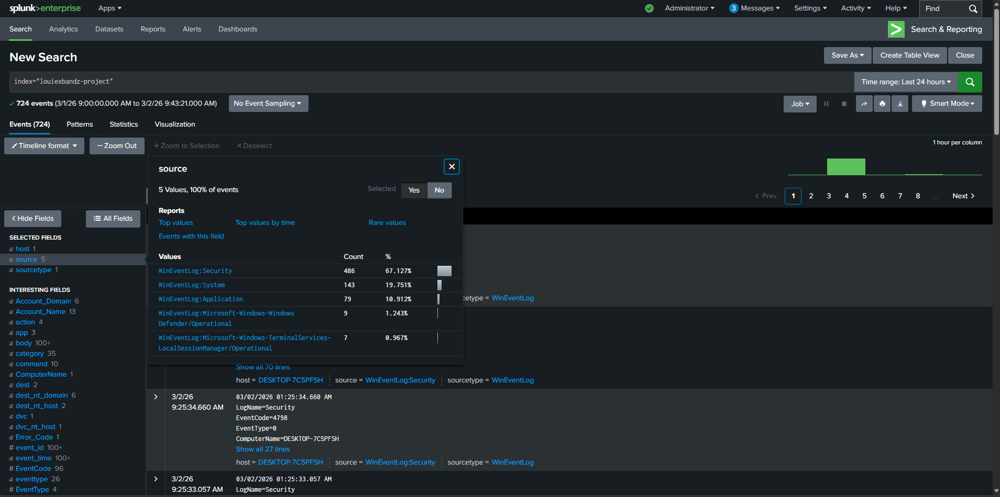
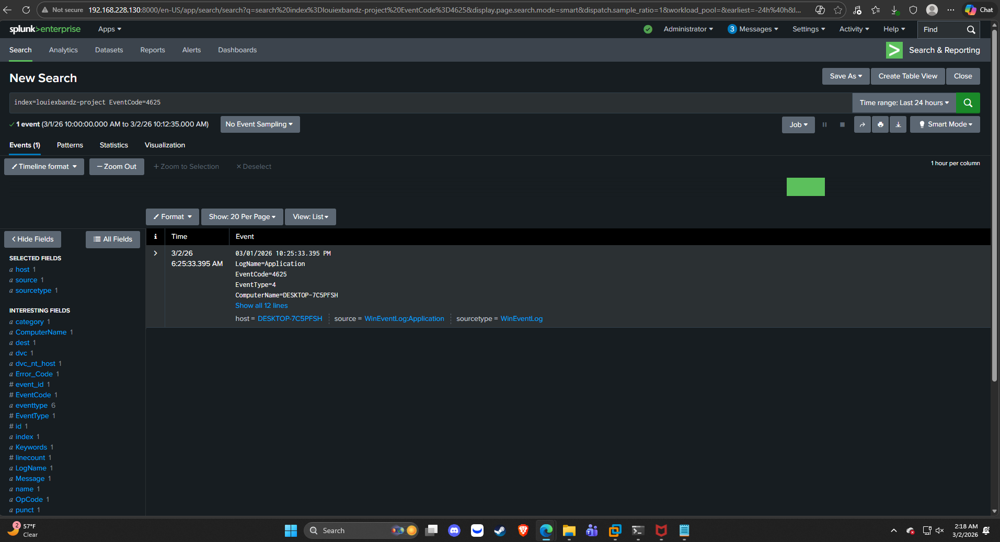
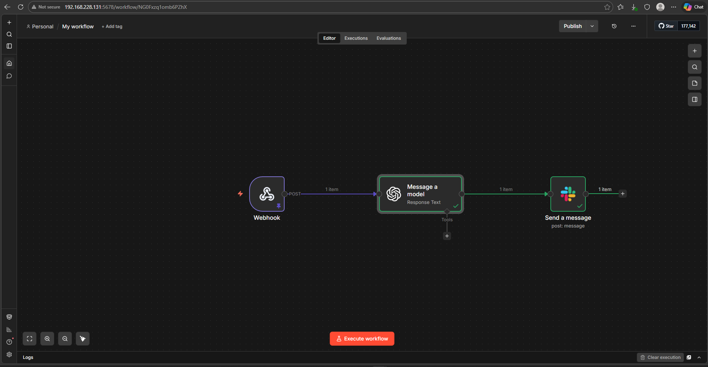
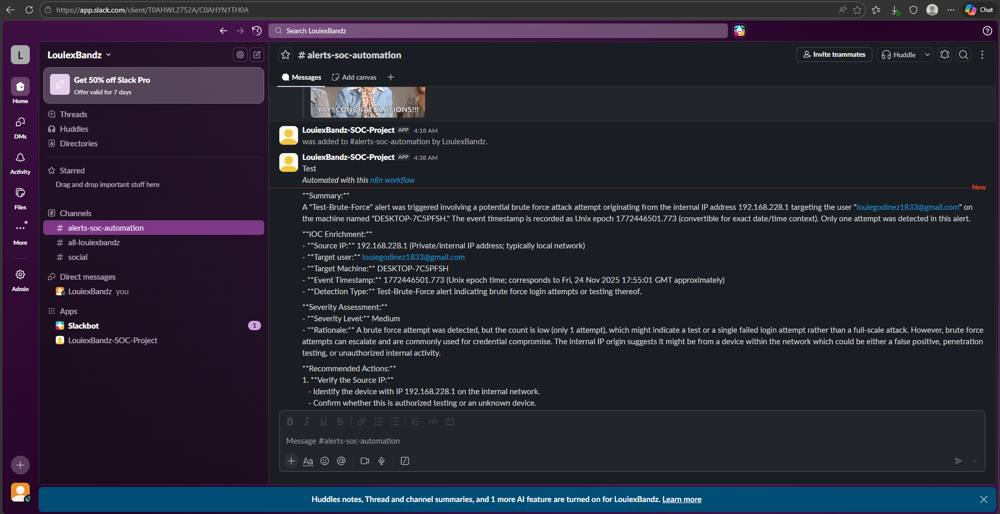

# AI-SOC-Automation-Lab
AI-driven SOC automation lab using Splunk, n8n, OpenAI, and Slack.
# 🚨 AI-Driven SOC Automation Lab
Splunk + n8n + OpenAI + Slack

## 📌 Overview

This project simulates a modern Security Operations Center (SOC) workflow by combining log ingestion, detection engineering, automation, and AI-assisted incident triage.

The goal was to move beyond basic alerting and build an automated pipeline that detects suspicious activity, analyzes it using AI, and delivers structured SOC-style incident reports in real time.

---

## 🏗 Architecture

Windows 10 VM  
⬇  
Splunk Enterprise (Linux VM)  
⬇  
Detection Rule (EventCode 4625)  
⬇  
Webhook → n8n (Docker)  
⬇  
OpenAI API Analysis  
⬇  
Slack Alert (Structured SOC Report)

---

## 🖥 Lab Environment

- Splunk Enterprise deployed on Ubuntu Linux  
- Windows 10 VM as log source  
- n8n running in Docker  
- Slack Webhook integration  
- OpenAI API integration  
- Private lab network (192.168.x.x)

---

## 🔍 Log Ingestion

Windows logs collected:

- Security  
- System  
- Sysmon  
- PowerShell  

Custom Splunk index created:
`louiexbandz-project`

Example detection query:

### Log Ingestion Screenshot

---

## 🛡 Detection Logic

Custom detection built for failed login attempts (EventCode 4625).

The alert is configured to trigger when suspicious authentication activity is detected and forward structured alert data via webhook.

### Failed Login Detection

---

## ⚙ Automation Workflow (n8n)

The n8n workflow includes:

- Webhook trigger node  
- JSON parsing  
- OpenAI processing node  
- Slack notification node  

This allows automated transformation of raw event data into a structured SOC-style report.

### n8n Workflow

---

## 🤖 AI-Assisted Triage

OpenAI analyzes the alert payload and generates:

- Executive-style summary  
- Severity classification  
- Risk rationale  
- Investigation steps  
- Recommended remediation  

This simulates Tier 1 SOC analyst triage.

### Slack Alert Output

---

## 🧠 Skills Demonstrated

- SIEM deployment and configuration  
- Linux system administration  
- Windows log forwarding  
- Detection engineering  
- Webhook integrations  
- API integration and JSON parsing  
- Docker containerization  
- Automation workflows  
- AI-assisted security operations  

---

## 🚀 Future Improvements

- Threat intelligence enrichment (IP reputation lookup)  
- Conditional severity scoring  
- Automated response playbooks  
- Multi-detection expansion  
- SOAR-style branching logic  

---

## 🙌 Acknowledgment

This lab build was inspired by educational MyDFIR Youtube Channel @https://www.youtube.com/@MyDFIR-focused it helped me expand into a customized environment with AI-driven automation enhancements.
